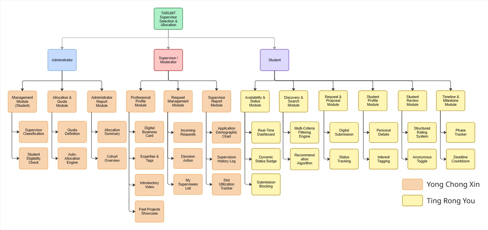

<a id="readme-top"></a>

<br />
<div align="center">
  <a href="https://github.com/TingRongYou/fyp-supervisor-selection-and-allocation-system">
    
  </a>

  <h3 align="center">SSAS — Supervisor Selection and Allocation System</h3>

  <p align="center">
    A streamlined system for managing student-supervisor selection and auto allocation processes.
    <br />
    <a href="https://github.com/TingRongYou/fyp-supervisor-selection-and-allocation-system"><strong>Explore the docs »</strong></a>
    <br />
    <br />
    <a href="https://github.com/TingRongYou/fyp-supervisor-selection-and-allocation-system">View Demo</a>
    &middot;
    <a href="https://github.com/TingRongYou/fyp-supervisor-selection-and-allocation-system">Report Bug</a>
    &middot;
    <a href="https://github.com/TingRongYou/fyp-supervisor-selection-and-allocation-system">Request Feature</a>
  </p>
</div>

<details>
  <summary>Table of Contents</summary>
  <ol>
    <li><a href="#about-the-project">About the Project</a></li>
    <li><a href="#built-with">Built With</a></li>
    <li><a href="#getting-started">Getting Started</a>
      <ul>
        <li><a href="#1-prerequisites">1. Prerequisites</a></li>
        <li><a href="#2-cloning-the-repository">2. Cloning The Repository</a></li>
        <li><a href="#3-database-initialisation">3. Database Initialisation</a></li>
        <li><a href="#4-architecture-overview">4. Architecture Overview</a></li>
      </ul>
    </li>
    <li><a href="#development">Development</a>
      <ul>
        <li><a href="#1-team-workload-distribution">Team Workload Distribution</a></li>
        <li><a href="#2-development-rules">Development Rules</a></li>
        <li><a href="#3-role-based-access-control-rbac">Role-Based Access Control (RBAC)</a></li>
        <li><a href="#4-coding-standards">Coding Standards</a></li>
      </ul>
    </li>
    <li><a href="#demo">Demo</a>
      <ul>
        <li><a href="#1-student">Student</a></li>
        <li><a href="#2-supervisor">Supervisor</a></li>
        <li><a href="#3-admin">Admin</a></li>
      </ul>
    </li>
    <li><a href="#license">License</a></li>
    <ul>
      <li><a href="#disclaimer">Disclaimer</a></li>
    </ul>
    <li><a href="#contact">Contact</a></li>
  </ol>
</details>

## About The Project

The Supervisor Selection and Allocation System (SSAS) is a web-based Final Year Project (FYP) management platform developed for TAR UMT.

The Supervisor Selection and Allocation System (SSAS) was developed to eliminate the chaos and inefficient manual processes traditionally involved in Final Year Project (FYP) supervisor matching.

**The Problem with Manual Selection**\
Previously, supervisor allocation relied heavily on manual Excel spreadsheet management and disconnected communication using Email.
 1. **Inefficient Communication:** Students rely on static supervisor lists and manual email inquiries to submit project proposals. This process is opaque, leaving students to wait indefinitely for responses without clear visibility into supervisor status or availability. 
 2. **Redundant Data Entry & Inconsistency:** The workflow forces both students and supervisors to independently update separate Excel spreadsheets to confirm project acceptance. This fragmented approach frequently leads to redundant work and data discrepancies, making it difficult to maintain a "single source of truth."
 3. **High Workload:** The supervisors are forced to review a large amount of proposal Email, which is exhaustive, the high workload might forces some of the supervisor to skip on giving comment on some of the rejected proposals, causing the students to wait infinitely for reply.
 4. **Administrative Bottlenecks:** Coordinators are tasked with manually compiling disparate spreadsheets to track allocations. They are then forced to perform the high-pressure, manual task of assigning unallocated students to supervisors, increasing the risk of administrative errors and overall system inefficiency.

 This lack of a centralized system made it incredibly difficult for students to know which supervisors still had available quotas, leading to blind applications, communication gaps, and administrative bottlenecks. The whole process is error prone, consume a lot of resources and leaves a bad experience for all of the personnel involves in the process.

**Our Solution**\
SSAS provides a centralized, web-based platform that digitalizes and automates the entire allocation lifecycle. It solves the inefficiencies of the manual process by:
* **Providing Real-Time Visibility:** Students can view supervisor profiles, academic backgrounds, and most importantly, real-time quota availability before submitting a request.
* **Digitalizing Proposals:** Students submit their project proposals and PDF documents directly through the platform, and are automatically rejected after 72 hours of no reply, eliminate endless wait.
* **Quick and Easy Student Acceptance and Rejection:** The supervisors can easily accept and reject the students by simply clicking a button, and leaving a quick comment on their proposals, without the need to draft an email for it, increasing the supervisor's enthusiasm.
* **Automating Quota Management:** Supervisors can review, accept, or reject applications online, while the system's backend allocation engine strictly tracks and enforces quota limits to prevent over-allocation.
* **Eliminating unnecessary processes:** Students, supervisors and coordinators are not required to fill in separate Excel forms, reducing the risk of inconsistency and redundant information.

<p align="right">(<a href="#readme-top">back to top</a>)</p>

## Built With
This section lists the tools used for the SSAS project.
* **Frontend**:
    * HTML5
    * CSS3
    * Vanilla JavaScript
* **Backend**:
    * PHP 8.0.30
* **Database**:
    * MySQL
* **Development Environment & Tools**:
    * XAMPP (Apache/MySQL)
    * Visual Studio Code
    * Git & GitHub (for version control and team collaboration)
    * Database Client JDBC (for schema management)

<p align="right">(<a href="#readme-top">back to top</a>)</p>

## Getting Started
To ensure code compatibility and prevent database conflicts, please follow these exact steps to set up the SSAS project on your local workstation.

### 1. Prerequisites
You **must** use the exact same XAMPP version as the rest of the team to ensure PHP 8.0 compatibility.
* **Download XAMPP:** XAMPP for Windows`8.0.30 / PHP 8.0.30 64-bit version` at [Apache Friend websites](https://www.apachefriends.org/download.html).
* **IDE:** Visual Studio Code.
* **Required VS Code Extensions:** Please install the following extensions: 
    * `Database Client JDBC (by database-client.com)`- Connect local MySQL and run database initialisation scripts.
    * `PHP Intelephense (by intelephense.com)` - PHP syntax highlighting, auto-completion, and error tracking.
    * `Prettier - Code Formatter (by prettier.io)` - Maintain consistent HTML/CSS/JS styling across the team.

### 2. Cloning the Repository
Your local server needs to host the files. Do not clone this to your Desktop. 
1. Navigate to your XAMPP installation's public directory: `C:\xampp\htdocs\`
2. Open your terminal in this folder and run:
   ```bash
   git clone git@github.com:TingRongYou/fyp-supervisor-selection-and-allocation-system.git ssas
   ```
3. Open the newly created SSAS folder in VS Code

### 3. Database Initialisation
We are using a single "idempotent" SQL script to build the entire database architecture at once.
1. Open the XAMPP Control Panel and Start both Apache and MySQL.
2. Inside VS Code, locate the `database/schema.sql` file.
3. You can execute this file using the VS Code Database Client extension. _(Note: Our schema.sql includes a DROP DATABASE IF EXISTS command. You can run this file as many times as you want to instantly reset your local database to a clean slate during testing.)_

### 4. Architecture Overview
This project strictly follows a 2-Tier Client-Server Layered Architecture. Please ensure new files are created in their designated layers:

```plaintext
ssas/
│
├── .github/
│   └── workflows/                  # CI/CD pipelines
│
├── client/                         # Frontend Presentation Layer
│   ├── admin/
│   ├── assets/
│   │   ├── css/
│   │   ├── img/
│   │   └── js/
│   ├── auth/
│   ├── shared/
│   ├── student/
│   └── supervisor/
│
├── database/                       # SQL Schema & Seed Data
├── docs/                           
│   └── img/                   
│
├── server/
│   ├── application/                # API Gateway & Controllers
│   │   ├── admin/
│   │   ├── auth/
│   │   ├── student/
│   │   └── supervisor/
│   │
│   ├── business/                   # Core Business Logic Layer
│   │   ├── decorators/
│   │   ├── entities/
│   │   ├── factories/
│   │   ├── services/
│   │   └── states/
│   │
│   └── data/                       # Data Access Layer
│       ├── dao/
│       ├── database/
│       └── storage/
│
├── storage/                        # External File Storage (Ignored by Git)
│   ├── intro_videos/
│   ├── profile_photos/
│   └── proposals/
│
├── .gitignore
├── .htaccess
└── README.md
```

* `/client` - Presentation Layer organized by system roles (`admin`, `student`, `supervisor`), authentication pages (`auth`), shared UI components (`shared`), and static web assets (`css`, `img`, `js`).
* `/server/application` - API Gateway acting as controllers. It handles session validation, request routing, and delegates tasks to the business layer (organized by role modules).
* `/server/business` - The Core Logic layer containing system services, domain `entities`, and structural design patterns (`states`, `factories`, `decorators`).
* `/server/data` - The Data Access Layer containing Data Access Objects (`dao`), PDO database connection scripts (`database`), and file system managers (`storage`).
* `/database` - SQL schema blueprints and CSV data required to initialize the local environment.
* `/storage` - Local directory for user-uploaded media (`proposals`, `profile_photos`, `intro_videos`). This is intentionally ignored by Git to prevent repository bloat.

<p align="right">(<a href="#readme-top">back to top</a>)</p>

## Development

### 1. Team Workload Distribution


### 2. Development Rules

All implementation strictly follow:

* Functional Requirements (FR)
* Non-Functional Requirements (NFR)
* ERD Diagrams
* DFD Diagrams
* Activity Diagrams
* Class Diagrams
* Sequence Diagrams
* Business Rules
* Allocation Algorithms
* System Architecture Design
* Waterfall SDLC Documentation

_For more information, please refer to the [Documentation](https://github.com/TingRongYou/fyp-supervisor-selection-and-allocation-system.git)_

### 3. Role-Based Access Control (RBAC)

The system implements strict role-based authorization.

**System Roles:**
* Student
* Supervisor
* Administrator

**Authorization Rules:**
* Students can only manage their own applications
* Supervisors can only manage assigned requests
* Administrators have full system access
* Protected routes must validate session authentication
* Unauthorized access attempts must be blocked

### 4. Coding Standards

**Backend Rules:**
* **Layer Isolation:** Business logic must remain inside `/server/business`, database queries inside `/server/data`, and API/Controllers inside `/server/application`.
* **Design Patterns:** Maintain the established design patterns.
* **Data Access:** All database interactions must be routed strictly through Data Access Objects (DAOs). The frontend must never directly access the database.
* **Security:** Use PDO prepared statements exclusively to prevent SQL injection vulnerabilities.

**Frontend Rules:**
* **Separation of Concerns:** Maintain strict separation between presentation (HTML/CSS) and backend API logic.
* **Role-Based Boundaries:** UI components and scripts must stay within their designated role directories (`admin`, `student`, `supervisor`, `shared`).
* **Asynchronous Operations:** Use modular Vanilla JavaScript for non-blocking server communication.
* **Reusability:** Keep UI components modular and maintainable.

**General Rules:**
* **Consistency:** Follow naming consistency across all modules and files.
* **Documentation Compliance:** Preserve ERD relationships, database constraints, class relationships, and workflow integrity exactly as defined in the project documentation.
* **DRY Principle (Don't Repeat Yourself):** Avoid duplicate business logic implementations.

<p align="right">(<a href="#readme-top">back to top</a>)</p>

## Demo

### 1. Student

<div align="center">

  <a href="https://github.com/x">
    
  </a>

   <h3 align="center">This is a Placeholder</h3>

</div>

### 2. Supervisor

<div align="center">

  <a href="https://github.com/x">
    
  </a>

   <h3 align="center">This is a Placeholder</h3>

</div>

### 3. Admin

<div align="center">

  <a href="https://github.com/x">
    
  </a>

   <h3 align="center">This is a Placeholder</h3>

</div>

<p align="right">(<a href="#readme-top">back to top</a>)</p>

## License

Copyright &copy; 2025/26 by Tunku Abdul Rahman University of Management and Technology (TAR UMT).

All rights reserved. No part of this project, including its documentation and source code, may be reproduced, stored in a retrieval system, or transmitted in any form or by any means without prior permission of Tunku Abdul Rahman University of Management and Technology.

<a id="disclaimer"></a>
### ⚠️ Disclaimer

This repository contains an academic Final Year Project (FYP) developed by undergraduate students. It is **not** an official system commissioned, endorsed, or deployed by Tunku Abdul Rahman University of Management and Technology (TAR UMT). The university's name, logo, and related trademarks are used strictly for academic context, prototyping, and demonstration purposes.

<p align="right">(<a href="#readme-top">back to top</a>)</p>

## Contact
* Ting Rong You - [ryting999@gmail.com](ryting999@gmail.com) - [LinkedIn](https://linkedin.com/in/ting-rong-you-945aab3b6)
* Yong Chong Xin - [yongchongxin0517@gmail.com](yongchongxin0517@gmail.com) - [LinkedIn](https://www.linkedin.com/in/yong-chong-xin-55aab13b6/)

Project Link: https://github.com/TingRongYou/fyp-supervisor-selection-and-allocation-system.git

<p align="right">(<a href="#readme-top">back to top</a>)</p>